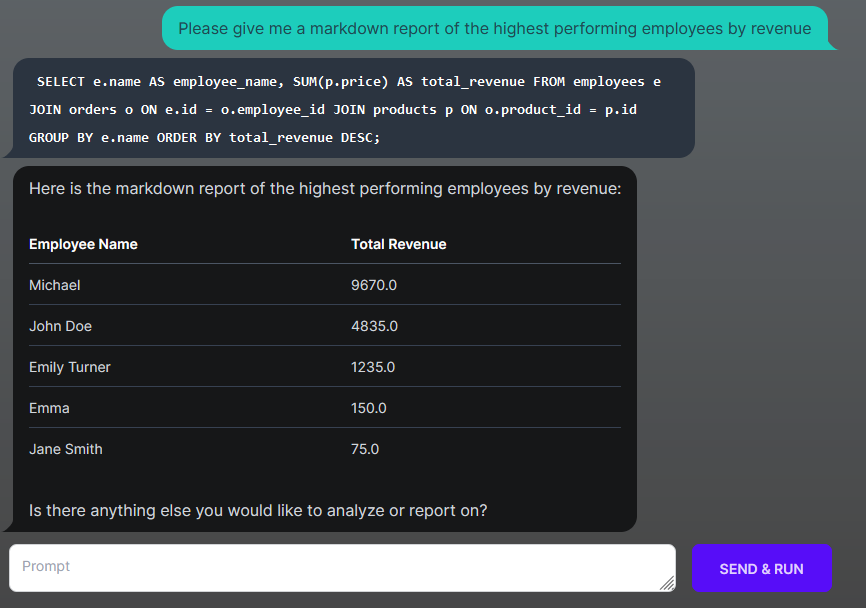

## DBChat Client

DBChat is an AI-assistant program integrated with a MySQL client. This project (DBChat Client) is a client that connects to the [GPTBlocks](gptblocks.co/dbchat) endpoint for use with the assistant.


### Example

```
$ python client.py --mysql-database=mydatabase --mysql-user myuser --mysql-password mypassword --host localhost
Enter API header: Basic sk_...


SELECT e.name AS employee_name, SUM(p.price) AS total_revenue
FROM employees e
JOIN orders o ON e.id = o.employee_id
JOIN products p ON o.product_id = p.id
GROUP BY e.name
ORDER BY total_revenue DESC;
```




### Usage

To run the DBChat Client, use the following command:

```bash
python client.py [--audit] [--mysql-database <database>] [--mysql-user <username>] [--mysql-password <password>] [--host <host>] [--base-url <base_url>] [--api-header <header>]
```

### Arguments

The DBChat Client accepts the following arguments:

* `--audit`: Enable audit mode. This mode allows you to approve or deny SQL queries before execution.
* `--mysql-database <database>`: The name of the MySQL database to connect to. If not provided, the client will prompt for the database name.
* `--mysql-user <username>`: The username for the MySQL connection. If not provided, the client will prompt for the username.
* `--mysql-password <password>`: The password for the MySQL connection. If not provided, the client will prompt for the password.
* `--host <host>`: The host for the MySQL connection. If not provided, the client will prompt for the host.
* `--base-url <base_url>`: The base URL for the GPTBlocks endpoint. If not provided, the client will use the default value.
* `--api-header <header>`: The API header for authentication. If not provided, the client will prompt for the header.

### Acquiring API Header

To acquire an API key from your user page at gptblocks.co/user, follow these steps:

1. Go to gptblocks.co/user and log in to your account.
2. Navigate to your user page.
3. Locate the API key section.
4. Generate or copy your API key.

The API Header should be in the following format:

```
Basic sk_abcdefghi
```

### Usage Tips

* The assistant performs best when you start the conversation with a request to list tables, and to then describe the schemas for the tables.

* For databases containing sensitive or production data, the user provided to the client should have limited perms

* Try asking the AI to generate views or markdown reports for you

### Todo

* [x] Integrate with OpenAI, mysql
* [ ] Integrate more databases to expand the client's compatibility.
* [ ] Develop a cloud version of the client that can be self-hosted or used as a service.
* [ ] Add support for code execution, DBT (Data Build Tool), and other related functionalities.
